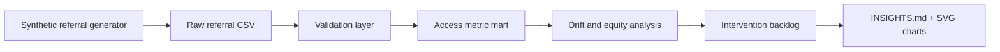

# CareRoute Equity Lab

CareRoute Equity Lab is a synthetic healthcare operations analytics project focused on specialty-referral access. It detects referral leakage, wait-time drift, and access-equity gaps across patient segment, payer, geography, specialty, urgency, and network adequacy.

The project is similar in maturity to ClaimFlow Parity Lab, but it analyzes a different operational problem: patients who are referred for specialty care but wait too long, miss appointments, or leak out of the network before completing care.

## Why This Is Different

Generic healthcare dashboards often count appointments. CareRoute asks a more operational question:

> Which referral pathways are losing patients, where are wait times drifting, and which access intervention should the organization prioritize first?

The project produces:

- A configurable synthetic specialty-referral workflow generator
- Validation checks for dates, statuses, leakage flags, and access metrics
- Referral conversion, leakage, no-show, and wait-time metrics
- Drift detection for recent-vs-baseline access performance
- Equity-gap analysis by patient segment, payer, region, and specialty
- A prioritized intervention backlog
- Markdown executive insights and SVG charts

## Architecture



## Quickstart

```powershell
python -m pip install -e .
python -m careroute.cli demo --referrals 6000 --days 180 --seed 42
python -m unittest discover -s tests
```

The demo writes:

- `data/referral_routes.csv`
- `reports/metric_summary.csv`
- `reports/access_rates.csv`
- `reports/drift_table.csv`
- `reports/equity_gap_table.csv`
- `reports/intervention_backlog.csv`
- `reports/INSIGHTS.md`
- `reports/figures/leakage_heatmap.svg`
- `reports/figures/wait_drift_bars.svg`

## CLI

```text
python -m careroute.cli generate --referrals 6000 --days 180 --seed 42
python -m careroute.cli validate
python -m careroute.cli analyze
python -m careroute.cli report
python -m careroute.cli demo
python -m careroute.cli clean
```

## Metric Definitions

- Referral leakage rate: referrals marked leaked divided by all referrals.
- Completion rate: completed specialty appointments divided by all referrals.
- No-show rate: no-shows divided by scheduled non-leaked referrals.
- Median wait days: median days from referral to appointment.
- Long-wait share: referrals with wait days above 30 days.
- Drift delta: recent leakage or wait metric minus baseline value for the same cohort.
- Equity gap: cohort leakage rate minus the portfolio average, with deferred visit value attached.
- Intervention impact score: affected referral volume times average expected visit value times an evidence-weighted confidence factor.

## Synthetic Dataset

Each row represents one specialty referral workflow:

| Column | Meaning |
| --- | --- |
| `referral_id` | Synthetic referral identifier |
| `patient_segment` | Commercial, Medicaid, Medicare, or uninsured |
| `region` | Synthetic operating region |
| `payer` | Synthetic payer |
| `specialty` | Referred specialty |
| `urgency` | Routine or urgent |
| `referral_source` | Referring clinic |
| `referral_date` | Referral creation date |
| `authorization_required` | Whether payer authorization is required |
| `network_status` | In-network, narrow-network, or out-of-network |
| `capacity_score` | Synthetic specialty capacity score |
| `community_need_index` | Synthetic social/access need score |
| `appointment_date` | Scheduled appointment date |
| `completion_status` | Completed, no-show, cancelled, or leaked |
| `leakage_reason` | Reason for leaked referral, or none |
| `wait_days` | Referral-to-appointment wait |
| `care_gap_days` | Extra wait days beyond the target threshold |
| `expected_visit_value` | Synthetic expected visit value |

## Limitations

This project does not use PHI, EHR records, real payer contracts, or real scheduling data. It is an offline analytics demonstration designed to show healthcare access analytics, operational metric design, validation, and stakeholder reporting.

## Uniqueness Check

Before building, exact-match searches for names such as "CareRoute Equity Lab", "ReferralFlow Equity Lab", and "Referral Access Equity Lab" did not surface an obvious existing GitHub project with this name/concept. Adjacent industry concepts exist around referral leakage and access management, so this project deliberately combines wait-time drift, referral leakage, equity gaps, and intervention prioritization in one reproducible portfolio package.
