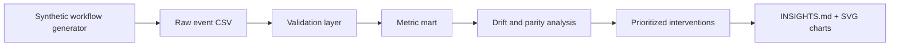

# ClaimFlow Parity Lab

ClaimFlow Parity Lab is a synthetic healthcare operations analytics project that detects denial drift and access-parity gaps across prior authorizations, claims, payers, service lines, and documentation quality.

The idea is intentionally narrower than a generic "retention dashboard" or "ELT pipeline": it models a realistic Health IT workflow where patients move from authorization request to payer decision, claim submission, denial, appeal, and overturn. The project is fully offline and uses synthetic data only.

## Why This Is Different

Many portfolio projects stop at cohort charts. ClaimFlow asks an operations question a provider, payer, or digital-health team would actually care about:

> Which denial patterns are changing, which patient segments are affected, and which fixes would recover the most care access and revenue?

The project produces:

- A configurable synthetic prior-auth and claims dataset
- Data-quality checks that fail loudly on invalid workflow records
- Denial, appeal, cycle-time, and avoidable-denial metrics
- Drift detection between baseline and recent windows
- A parity-gap table across payer, service line, region, and patient segment
- A prioritization model that ranks operational fixes by impact
- A Markdown executive report and SVG charts

## Architecture



## Quickstart

```powershell
python -m pip install -e .
python -m claimflow.cli demo --patients 5000 --days 180 --seed 42
python -m unittest discover -s tests
```

The demo writes:

- `data/claimflow_events.csv`
- `reports/metric_summary.csv`
- `reports/drift_table.csv`
- `reports/parity_table.csv`
- `reports/intervention_backlog.csv`
- `reports/INSIGHTS.md`
- `reports/figures/denial_heatmap.svg`
- `reports/figures/drift_bars.svg`

## CLI

```text
python -m claimflow.cli generate --patients 5000 --days 180 --seed 42
python -m claimflow.cli validate
python -m claimflow.cli analyze
python -m claimflow.cli report
python -m claimflow.cli demo
python -m claimflow.cli clean
```

## Metric Definitions

- Denial rate: denied claims divided by total claim decisions.
- Avoidable denial share: denied claims whose denial reason is documentation, coding, eligibility, or timely filing.
- Appeal rate: appealed denials divided by denied claims.
- Overturn rate: overturned appeals divided by appealed denials.
- Median cycle time: median days from authorization request to final claim decision.
- Drift delta: recent denial rate minus baseline denial rate for the same cohort.
- Parity gap: cohort denial rate minus overall denial rate, with volume and average expected reimbursement attached.
- Impact score: avoidable denials times average expected reimbursement times an intervention-specific confidence weight.

## Synthetic Dataset

Each row represents a completed authorization-to-claim workflow:

| Column | Meaning |
| --- | --- |
| `encounter_id` | Synthetic workflow identifier |
| `patient_segment` | Commercial, Medicaid, Medicare, or uninsured |
| `region` | Synthetic operating region |
| `payer` | Synthetic payer |
| `service_line` | Imaging, cardiology, behavioral health, orthopedics, oncology, or primary care |
| `request_date` | Authorization request date |
| `decision_date` | Payer authorization decision date |
| `claim_date` | Claim submission date |
| `finalized_date` | Final claim decision date |
| `auth_status` | Approved, denied, or not required |
| `claim_status` | Paid or denied |
| `denial_reason` | None for paid claims; operational denial reason for denied claims |
| `appealed` | Whether a denied claim was appealed |
| `overturned` | Whether the appeal overturned the denial |
| `documentation_score` | 0-100 synthetic completeness score |
| `expected_reimbursement` | Synthetic expected reimbursement in dollars |

## Limitations

This project does not use real patient data, PHI, payer contracts, or clinical records. It is an offline analytics demonstration designed to show healthcare data thinking, workflow modeling, validation, and PM-style prioritization.

## Uniqueness Check

Before building, exact-match searches for phrases such as "ClaimFlow Parity Lab", "Denial Drift Lab", "FHIR Claim Drift", and "Prior Auth Denial Drift" did not surface an obvious existing GitHub project with this concept/name. Similar industry concepts around care-path leakage and workflow visibility exist, so this project deliberately focuses on the combined denial-drift, access-parity, and intervention-prioritization angle.
