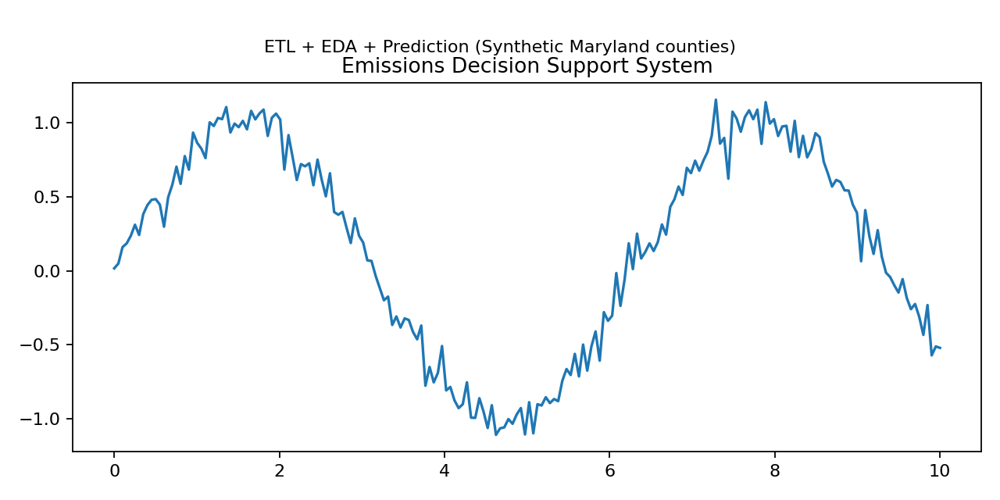

# Emissions Decision Support System (Maryland)

## Project Overview
This notebook-style project mirrors a real decision-support workflow: extract emissions records, clean inconsistent county/sector labels, standardize year ranges, and produce a modeling-ready dataset. The final step trains a baseline regression model to estimate emissions using county context (population/economic proxy) and sector.

## Dataset
This repo ships with a synthetic dataset (so the notebook runs end-to-end with no external downloads). It intentionally includes **messy county names** (case/spacing) and inconsistent sector labels to demonstrate cleaning.

### Data Dictionary
| Column | Meaning |
|---|---|
| county | Maryland county name (messy strings included intentionally) |
| year | Year of record |
| sector | Emissions sector/category |
| emissions_mtco2e | Greenhouse gas emissions (metric tons CO2e) **target** |
| population | County population estimate |
| gdp_billions_usd | Economic proxy (GDP in billions USD) |

## What’s inside
- `notebooks/01_emissions_decision_support.ipynb` — full workflow (cleaning → EDA → model → feature importance)
- `data/raw_emissions_maryland.csv` — raw input
- `reports/cleaned_emissions_maryland.csv` — cleaned output produced by the notebook

## How to run
Open the notebook and run all cells. Requires: pandas, numpy, matplotlib, seaborn, scikit-learn, scipy.
